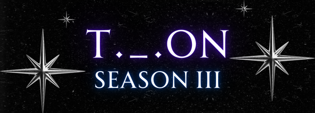
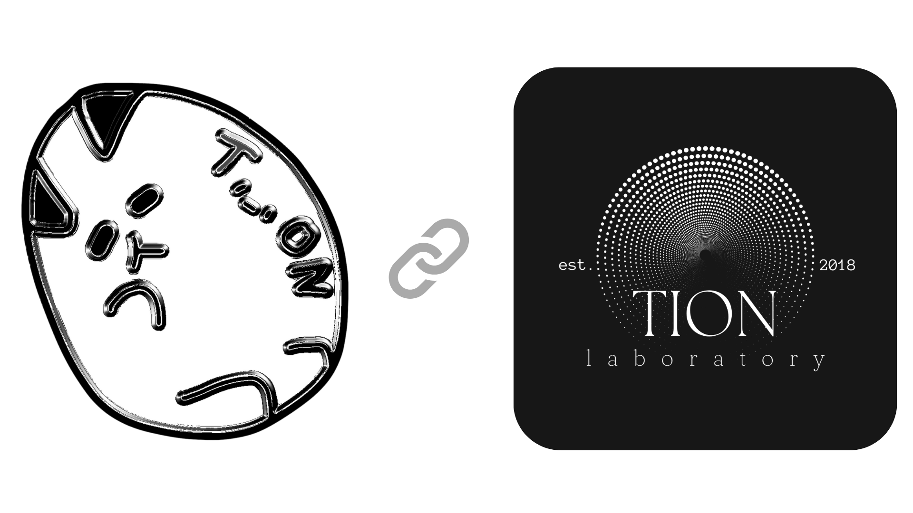

# ✨ Tion Software Laboratory ✨  
## 🔮Unleashing Power of Creation   자유로운 상상을 간단하지만 정교하게 현실화.

  
  
   
# Tation 타티온

   
  👨‍💻 웹/프로그램/서버 <strong>소프트웨어 개발자</strong>  & <strong>화이트햇</strong> 
  👨🏻‍🎓 <strong>2006년생</strong>, 만 18세 
  📦 외주는 이메일 문의.

#### 사용 언어
> $\bf{\color{#7081ff}Python\ /\ Javascript\ /\ Arduino\ /\ C\ /\ Go\ /\ Git}$

#### 사용 툴 / OS
> $\bf{\color{#7081ff}Vscode\ /\ Docker\ /\ Npm\ /\ Bun\ /\ Ubuntu\ /\ Raspberrypi}$

#### 학습 중
> $\bf{\color{#70b3ff}Java\ /\ Kotlin\ /\ Rust}$

#### 학습 예정
> $\bf{\color{#70eeff}Ruby\ /\ Android\ Studio\ /\ Svelte\ /\ Three.js\ /\ Unreal}$

<table align="center">
  <tr>
    <td align="center">
      
    </td>
    <td align="center">
      
    </td>
  </tr>
  <tr>
    <td align="center">
      
    </td>
    <td align="center">
      
    </td>
  </tr>
  <tr>
    <td align="center">
       
    </td>
    <td align="center">
      
    </td>
  </tr>
</table>

  
   
  © 2024 tionlab Est. 2018

